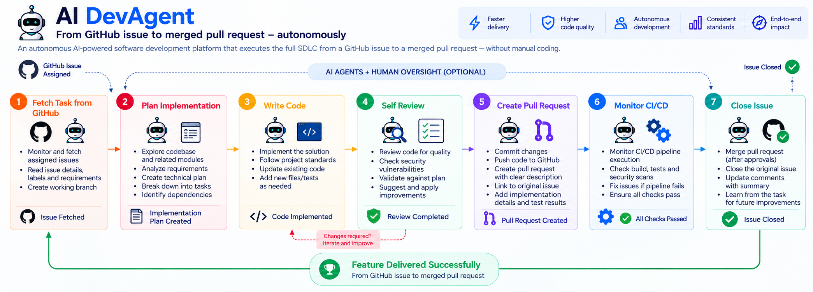

# AI DevAgent - Overview

## What is AI DevAgent?

AI DevAgent is an autonomous AI-powered software development platform that executes the full SDLC (Software Development Lifecycle) from a GitHub issue to a merged pull request - without manual coding.



A developer assigns a GitHub issue, and the AI agent autonomously:
1. Fetches the task from GitHub
2. Plans the implementation by exploring the codebase
3. Writes code following the approved plan
4. Self-reviews the code for quality
5. Commits, pushes, and creates a pull request
6. Monitors the CI/CD pipeline and closes the issue

Human-in-the-loop gates ensure the developer approves the plan before coding begins and approves the PR before merging.

## Problem Statement

Software teams spend significant time on repetitive implementation tasks — CRUD endpoints, boilerplate code, standard patterns. AI DevAgent automates these tasks end-to-end while keeping the developer in control through approval gates.

## Key Capabilities

- **Agentic AI Loop** — Claude tool_use API with iterative tool calling (read files, write files, run commands, git operations)
- **LangGraph Workflow** — State machine orchestration with 9 nodes and 6 conditional edges
- **Human-in-the-Loop** — Plan approval and merge approval gates (DB-persisted, polled)
- **Multi-Org** — Organizations with role-based user management
- **Skill System** — Customizable .md instructions per skill type (plan/develop/review) with repo-specific overrides
- **Live Progress** — Real-time split-panel UI showing agent activity, tool calls, reasoning, and logs
- **Full Audit Trail** — Every tool call, reasoning step, and log entry persisted in MS SQL

## Tech Stack

| Layer | Technology |
|-------|-----------|
| Backend API | Python 3.9+, FastAPI, SQLAlchemy (async) |
| Database | Microsoft SQL Server (Azure SQL) |
| AI/LLM | Claude API (tool_use for agentic loop) |
| Workflow | LangGraph (StateGraph) |
| Frontend | React 18, TypeScript, Tailwind CSS, Vite |
| Source Control | GitHub API (REST + GraphQL) |
| Encryption | Fernet symmetric encryption for stored credentials |

## Industrial Use Cases

### 1. Infrastructure Automation (Primary)

In large enterprises, application teams and infrastructure teams operate separately. When an app team needs a firewall rule, a Key Vault secret, a cloud resource, or a Kubernetes config change, the process is:

```
App Team                     Infra Team
   │                             │
   ├── Create Jira/GitHub ──────▶│ Manual review
   │   ticket                    │ Manual code change
   │                             │ Manual PR + deploy
   │◀── Wait days ───────────────│ Push to dev/staging/prod
```

**With AI DevAgent:**

```
App Team                     Infra Team + AI Agent
   │                             │
   ├── Create ticket ───────────▶│ Pull ticket
   │                             │ Agent reads requirements
   │                             │ Agent modifies Terraform/K8s YAML
   │                             │ Agent creates PR
   │◀── Hours, not days ─────────│ Infra engineer approves + merge
```

**Common repetitive tasks this automates:**
- Firewall rule additions (security group / NSG changes)
- Key Vault / KMS key creation and rotation config
- Cloud resource provisioning (storage accounts, databases, queues)
- Kubernetes manifest updates (deployments, services, ingress)
- CI/CD pipeline configuration changes
- Environment variable and secret management across environments

The AI agent understands the IaC codebase (Terraform, Helm, YAML), follows the existing patterns, and produces changes that match the project conventions - reducing a multi-day ticket to a single approval cycle.

### 2. Boilerplate Feature Development

Backend teams frequently implement similar patterns: CRUD endpoints, database migrations, API contracts. The agent can scaffold these following the project's established architecture (Clean Architecture, Repository pattern, etc.) while the developer focuses on complex business logic.

### 3. Cross-Team Standard Enforcement

Organizations with coding standards, security policies, or compliance requirements can encode these as **skills** (markdown instructions). The agent follows these standards automatically during development and self-review, ensuring consistency across teams without manual code reviews for standard patterns.

### Why This Matters

| Without AI DevAgent | With AI DevAgent |
|---------------------|-----------------|
| Days of wait time for infra changes | Hours - one approval cycle |
| Manual, error-prone repetitive work | Automated with pattern matching |
| Inconsistent standards across teams | Skills enforce standards automatically |
| Knowledge bottleneck on senior engineers | Agent learns from codebase patterns |
| Context switching for small tasks | Developer stays focused, agent handles tickets |
